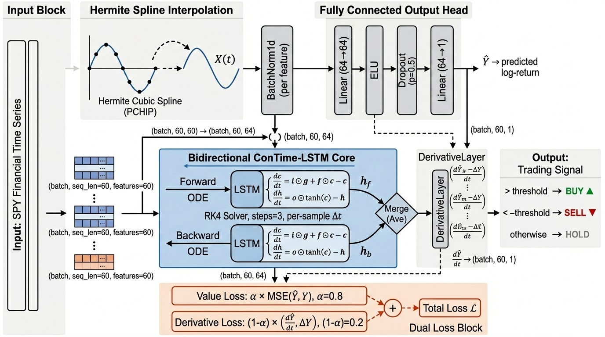

<div align="center">

# ConTime-LSTM: Continuous-Time LSTM with Neural ODE

**LSTM 기반 Neural ODE를 활용한<br>연속 시간 주가 수익률 예측 및 백테스트 시스템**

**조영서 · 김유정 · 백아영**

울산대학교 IT융합학부 졸업작품

*Jo, Yeong-Seo et al. "Neural ODEs with Hierarchical Embeddings for Financial Forecasting." ICFICE 2025, pp. 93–96.*

</div>

## Overview

금융 시장은 높은 변동성과 불규칙한 거래 간격을 가지며, 기존 LSTM·Transformer 기반 모델은 이산 시간 가정으로 인해 시장의 불연속성을 제대로 반영하지 못하고 **예측 지연(Prediction Delay)** 문제를 내포한다.

**ConTime-LSTM**은 Neural ODE를 LSTM에 접목한 연속 시간 주가 예측 프레임워크다. S&P 500 ETF(**SPY**) 단일 종목을 대상으로, 예측값과 시간 도함수를 동시에 학습하는 이중 손실 함수로 예측 지연을 억제한다.

---

## Model Architecture

<p align="center">
  
</p>

이산 시계열을 PCHIP(Hermite Cubic Spline)으로 연속 경로 $X(t)$에 보간한 뒤, **Bidirectional ConTime-LSTM**에 입력한다. 각 LSTM cell은 ODE로 일반화되어 샘플별 실제 거래 간격 $\Delta t$를 RK4로 적분한다. 순방향·역방향 은닉 상태를 평균 병합(Ave)한 후 FC layer로 예측값 $\hat{Y}$를 출력하고, `DerivativeLayer`가 시간 도함수 $d\hat{Y}/dt$를 계산한다.

```
BatchNorm → BiConTime-LSTM (RK4, steps=3) → Linear(64→64) → ELU → Dropout(0.5) → Linear(64→1) → DerivativeLayer
```

**손실 함수**: 예측값과 도함수를 동시에 학습하여 예측 지연을 억제한다.

$$\mathcal{L} = 0.8 \cdot \text{MSE}(\hat{Y},\, Y) + 0.2 \cdot \text{MSE}\!\left(\tfrac{d\hat{Y}}{dt},\, \Delta Y\right)$$

---

## Results

> 실험 환경: SPY 최근 10년 데이터, 5-seed 평균

### Benchmark Comparison

<div align="center">

|          Model          | Sharpe Ratio |  AUC   | DTW ↓  |  TDI ↓  |
| :---------------------: | :----------: | :----: | :----: | :-----: |
| **ConTime-LSTM (Ours)** |  **0.7646**  | **0.5909** | **2.4745** | 28.8713 |
|       ConTime-GRU       |    -0.2559   | 0.5188 | 2.6260 | 30.2610 |
|      Vanilla LSTM       |    0.5188    | 0.4837 | 2.3832 | 11.2476 |
|       Buy & Hold        |    0.5913    |   —    |   —    |    —    |

</div>

### Statistical Significance — DeLong AUC Test

<div align="center">

|         vs Model         | AUC (Ours) | AUC (Base) |   Z    | p-value | Sig |
| :----------------------: | :--------: | :--------: | :----: | :-----: | :-: |
|      Vanilla LSTM        |   0.5909   |   0.4837   |  2.677 |  0.0074 | ★★ |
|       ConTime-GRU        |   0.5909   |   0.5188   |  2.117 |  0.0342 |  ★  |

*★★ p < 0.01 · ★ p < 0.05*

</div>

---

## Project Structure

```
주식 예측 with NeraulODE/
├── scripts/
│   ├── prepare.py              # 데이터 수집 및 전처리
│   └── run.py                  # 모델 학습 / 저장된 모델로 예측
├── src/
│   ├── config.py               # 전역 설정
│   ├── contime.py              # ConTime-LSTM + RK4 ODE solver
│   ├── train.py                # 학습 루프, 시각화
│   ├── evaluate.py             # 백테스트, 임계값 탐색, 성능 지표
│   ├── plots.py                # 시각화 함수
│   └── data/
│       ├── collect.py          # yfinance 데이터 수집, FRED 경제 지표
│       ├── features.py         # 기술적 지표 계산 및 최적화
│       └── pipeline.py         # 전처리 파이프라인, 시계열 분할
├── output/
│   ├── raw/                    # 수집된 원시 데이터
│   ├── processed/              # 전처리된 데이터
│   ├── checkpoints/            # 학습된 모델 가중치
│   └── plots/                  # 시각화 결과
├── .env                        # API 키
└── requirements.txt
```

---

## Getting Started

### 1. 패키지 설치

```bash
pip install -r requirements.txt
```

### 2. 환경 변수 설정

`.env` 파일을 프로젝트 루트에 생성한다.

```env
FRED_API_KEY=your_fred_api_key_here
```

FRED API 키는 [https://fred.stlouisfed.org/docs/api/api_key.html](https://fred.stlouisfed.org/docs/api/api_key.html) 에서 무료 발급받을 수 있다.

### 3. 실행 순서

<div align="center">

| 단계 | 명령어 | 설명 |
| :--: | :----- | :--- |
| 1 | `python scripts/prepare.py` | 데이터 수집 및 전처리 |
| 2 | `python scripts/run.py` | 고정 하이퍼파라미터로 모델 학습 |
| 3 | `python scripts/run.py --predict` | 저장된 최적 모델로 예측 및 백테스트 |
